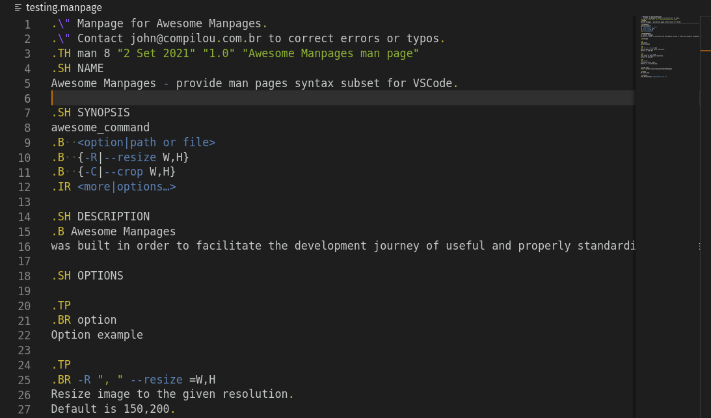

# VSCode Manpages Syntax Extension

[cc-by-nc-sa]: http://creativecommons.org/licenses/by-nc-sa/4.0/



**Yeah!** This is a super simple Man Pages syntax extension. Fell free to use and contribute!

# Getting started

Clone directly the extension to your VSCode extension path as suggested:
```sh
git clone git@github.com:jmurowaniecki/manpages.git ~/.vscode/extensions/
```

> **Wanna see more information about how to create your own man pages?**
>
> Take a look at these links and then let me know if you need any help (;
> - https://www.cyberciti.biz/faq/linux-unix-creating-a-manpage/
> - https://www.linuxhowtos.org/System/creatingman.htm
> - https://www.golinuxcloud.com/create-man-page-template-linux-with-examples/
> - https://ubuntu-mate.community/t/how-to-create-your-own-man-pages/7931
>

---

This work is licensed under a
[Creative Commons Attribution-NonCommercial-ShareAlike 4.0 International License][cc-by-nc-sa].
