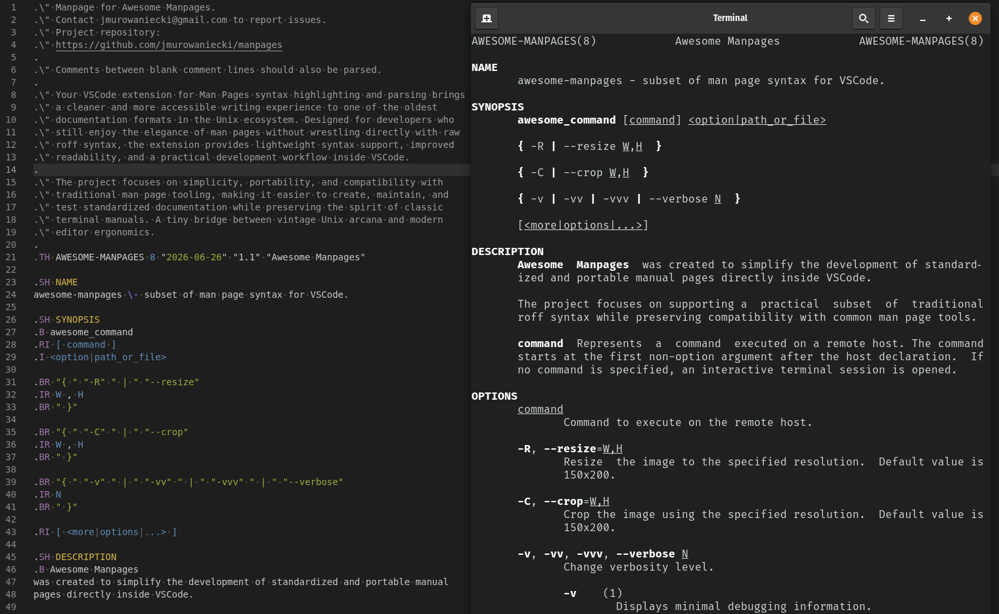

# VSCode Manpages Syntax Extension



[](https://www.bestpractices.dev/projects/10384)

**manpage** adds syntax highlighting for Unix/Linux manual pages (roff/man macros) in Visual Studio Code. It helps you read and edit `.man`, `.manpage`, and section files (`.1`–`.8`) with clearer structure for titles, headings, macros, and comments.

## Quick start

See [docs/QUICKSTART.md](docs/QUICKSTART.md) for a one-minute install-and-try path.

## Install

**From the Marketplace**

1. Open VS Code Quick Open (`Ctrl+P` / `Cmd+P`).
2. Paste and run:

```sh
ext install CompilouIT.manpage
```

Or install from the [Visual Studio Marketplace](https://marketplace.visualstudio.com/items?itemName=CompilouIT.manpage).

**From source (development)**

```sh
git clone https://github.com/jmurowaniecki/manpages.git
cd manpages
npm install
```

Then open the folder in VS Code (`File` → `Open Folder`) and press `F5` to launch an Extension Development Host, or symlink/copy the repo into your VS Code extensions directory.

## Use

Open any man-page source file (for example `foo.1` or `bar.man`). VS Code should select the **manpage** language automatically from the file extension. You can also choose **manpage** from the language mode picker in the status bar.

File associations, language configuration, and TextMate scopes are documented in [docs/INTERFACE.md](docs/INTERFACE.md).

## Feedback and contributions

- **Bugs and enhancements:** [GitHub Issues](https://github.com/jmurowaniecki/manpages/issues)
- **Pull requests:** see [CONTRIBUTING.md](CONTRIBUTING.md)
- **Security reports:** see [SECURITY.md](SECURITY.md)
- **Code of Conduct:** [CODE_OF_CONDUCT.md](CODE_OF_CONDUCT.md)
- **Governance:** [GOVERNANCE.md](GOVERNANCE.md)

## Documentation

| Doc | Purpose |
|-----|---------|
| [docs/QUICKSTART.md](docs/QUICKSTART.md) | Fast path for new users |
| [docs/INTERFACE.md](docs/INTERFACE.md) | External interface (extensions, scopes) |
| [docs/ARCHITECTURE.md](docs/ARCHITECTURE.md) | High-level design |
| [docs/ROADMAP.md](docs/ROADMAP.md) | Plans for the next year |
| [docs/ASSURANCE-CASE.md](docs/ASSURANCE-CASE.md) | Security requirements and threat model |
| [docs/SIGNED-RELEASES.md](docs/SIGNED-RELEASES.md) | How to verify releases |

## Achievements

- [OpenSSF Best Practices](https://www.bestpractices.dev/projects/10384) (badge above; update status on the site as criteria are met)

## Secure use

This extension only provides TextMate grammar and language configuration for editor highlighting. It does not execute man-page content, run shell commands, or contact the network. Treat untrusted `.man` files like any other untrusted text: open them only when you intend to review or edit them.

## Changelog

See [CHANGELOG.md](CHANGELOG.md) for release notes.

## Learn more about man pages

- [How To – Linux / UNIX Create a Manpage](https://www.cyberciti.biz/faq/linux-unix-creating-a-manpage/)
- [Creating Your Own MAN Page Version 1.0](https://www.linuxhowtos.org/System/creatingman.htm)
- [Create man page in Linux with examples](https://www.golinuxcloud.com/create-man-page-template-linux-with-examples/)
- [How to create your own man pages](https://ubuntu-mate.community/t/how-to-create-your-own-man-pages/7931)

## License

Licensed under the [MIT License](LICENSE).
